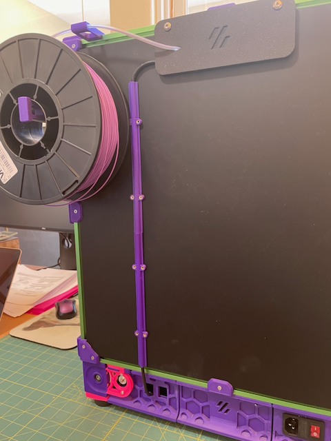

# CAN Cable Cover

 This is a cover for CANBus wire routing down the back of the printer. 
 I just went into an unused Keystone opening in the rear skirt.

## BOM
- 4x 3mm Heatset Inserts
- 4x M3x8 BHCS

 
